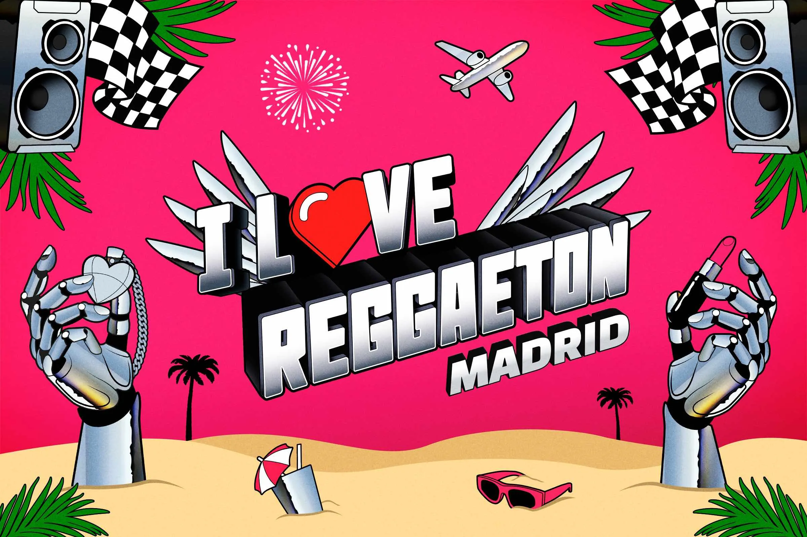
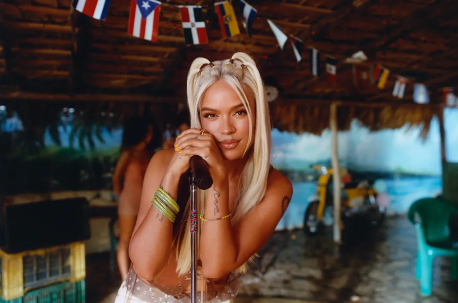
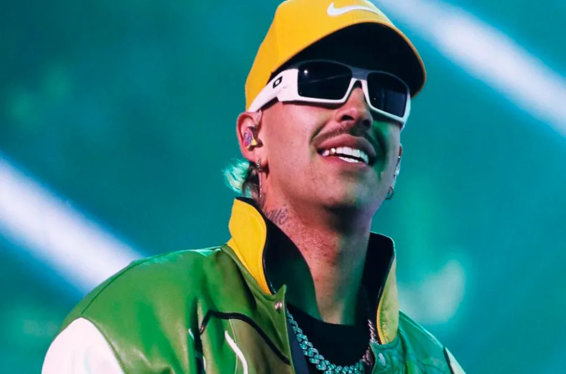
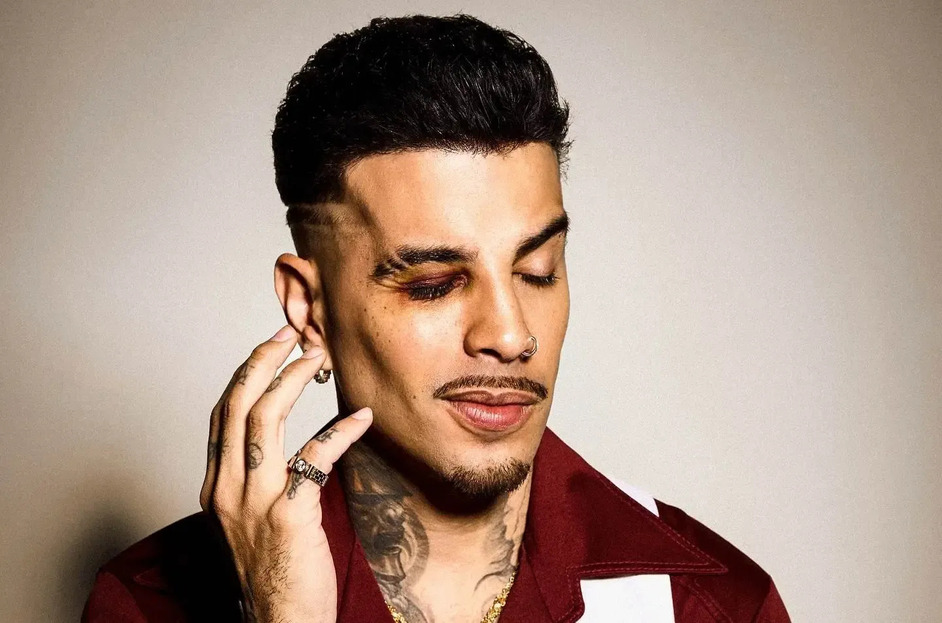
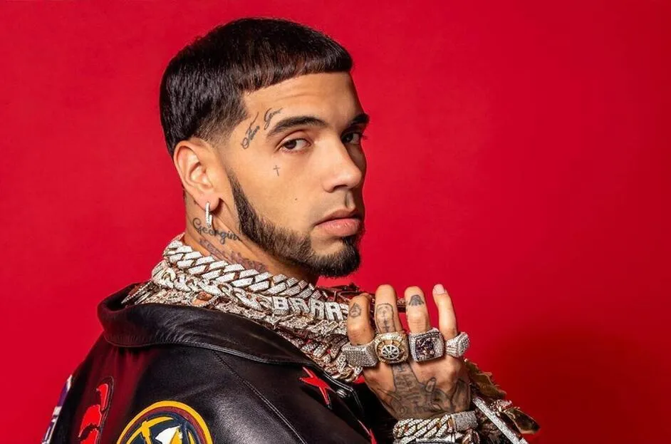

# 🎧 Landing Page: Cantantes de Reguetón

Este proyecto presenta una **Landing Page interactiva** dedicada a algunos de los artistas más influyentes del reguetón. El diseño incluye banners llamativos, enlaces a imágenes de alta calidad, y una experiencia visual y sonora única para los visitantes.

## 🎨 **Banner Principal**

  
*Un homenaje visual a los artistas más grandes del reguetón.*

---

## 🎯 **Cantantes de Reguetón**

### 1. **Bad Bunny**

**Biografía**: Benito Antonio Martínez Ocasio, conocido artísticamente como **Bad Bunny**, ha revolucionado la industria de la música con su estilo único que fusiona reguetón, trap, punk y electrónica.  
**Carrera**: Desde sus inicios en SoundCloud, Bad Bunny ha logrado un éxito masivo con discos como *YHLQMDLG* y *El Último Tour Del Mundo*, convirtiéndose en un fenómeno global.  
**Estilo Musical**: Reguetón, trap, rock, pop, y música electrónica.  
**Premios**: Ha recibido múltiples **Latin Grammy** y **Billboard Music Awards**.  
**Colaboraciones**: Ha trabajado con **Drake**, **J Balvin**, **Karol G**, **The Weeknd**, entre otros.

[Ver video musical de Bad Bunny](https://www.youtube.com/watch?v=a1Femq4NPxs)

---

### 2. **Karol G**
 

**Biografía**: Karol G, nacida en Medellín, Colombia, ha sido una de las principales exponentes del reguetón femenino. Ha logrado romper barreras y llevar su música a audiencias internacionales.  
**Carrera**: Con éxitos como *Tusa*, *Bichota*, y *Ay Dios Mío*, Karol G ha consolidado su posición como una de las artistas más influyentes de la música latina.  
**Estilo Musical**: Reguetón, pop, trap y música tropical.  
**Premios**: Ha ganado **Billboard Latin Music Awards** y **Premios Juventud**.  
**Colaboraciones**: **Anuel AA**, **Shakira**, **Nicki Minaj**, **Maluma**.

[Ver video musical de Karol G](https://www.youtube.com/watch?v=QCZZwZQ4qNs)

---

### 3. **J Balvin**
[.webp)](https://jbalvinstore.universalmusica.com/)  

**Biografía**: **J Balvin**, conocido como el "Príncipe del Reguetón", ha sido uno de los artistas más exitosos a nivel mundial. Su música ha ayudado a popularizar el reguetón en todas partes del mundo.  
**Carrera**: Con álbumes como *Vibras* y *Colores*, J Balvin ha alcanzado el éxito con hits como *Mi Gente* y *Ginza*.  
**Estilo Musical**: Reguetón, música electrónica y pop latino.  
**Premios**: Ganador de **Latin Grammy** y varios **Premios Billboard**.  
**Colaboraciones**: **Bad Bunny**, **Pharrell Williams**, **Cardi B**, **Luis Fonsi**.

[Ver video musical de J Balvin](https://www.youtube.com/watch?v=wnJ6LuUFpMo)

---

### 4. **Feid**
  

**Biografía**: **Feid** ha emergido como uno de los artistas más prometedores de la nueva ola de reguetón. Con un estilo fresco y melódico, ha conquistado a los fanáticos del género.  
**Carrera**: Desde sus inicios como compositor, Feid ha logrado gran popularidad con canciones como *Porfa* y *Baila Conmigo*.  
**Estilo Musical**: Reguetón melódico, con influencias de música tropical y urbana.  
**Premios**: Nominado a los **Premios Billboard Latin Music** y **Premios Juventud**.  
**Colaboraciones**: **Maluma**, **Karol G**, **J Balvin**, **Rauw Alejandro**.

[Ver video musical de Feid](https://www.youtube.com/watch?v=cD5T1Y4b7wA)

---

## 🖼️ **Galería de Imágenes de los Artistas**

Aquí tienes una galería interactiva con algunas de las mejores imágenes de los artistas. Haz clic en las imágenes para ver más detalles.

  

  

  

 

---

## 🎶 **Playlist Interactiva** 

Escucha una selección de canciones de los artistas más destacados del reguetón mientras navegas por la página:

- [Bad Bunny - *Vete*](https://www.youtube.com/watch?v=S5EKbAiIqYw)
- [Karol G - *Tusa*](https://www.youtube.com/watch?v=tbneQDc2H3I)
- [J Balvin - * Agua*](https://www.youtube.com/watch?v=QLz9VaksClg)
- [Feid - *Porfa*](https://www.youtube.com/watch?v=Hp__tcvnEnk)

---
